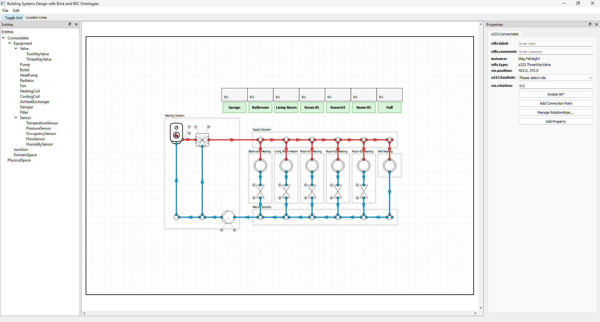

# Open223 Builder – Diagram Editor

A desktop app to model building systems with the 223p Ontology (https://open223.info/).

## Use

The window shows entities and scene hierarchy (left), canvas (center), and properties (right), with menu and toolbar on top.

You drag components onto a canvas, connect them, group them into systems, annotate with properties, and save/load as RDF/Turtle. It includes a grid canvas, an entities browser, a scene hierarchy, a properties panel, and full undo/redo.

## Save/Load Format

Models are serialized to Turtle using s223 (entities/relations), VISU (visual metadata), RDF/RDFS, and QUDT. Loading re-creates spaces, connectables, domain spaces, connection points, connections, properties, and systems, preserving labels, comments, roles, media, units, quantity kinds, and layout. New instance URIs are generated under the BLDG namespace to avoid collisions.

## Shortcuts

- Ctrl+S (Save)
- Ctrl+O (Load)
- Ctrl+Z/Y (Undo/Redo)
- Ctrl+C/V (Copy/Paste)
- Ctrl+A (Select all)
- R (Rotate 90°)
- Ctrl+G (Create system)
- Delete (Remove)
- Ctrl+L (Location lines)
- Ctrl + Mouse Wheel (Zoom)

## Notes

Snapping to grid is supported for item and property moves. PhysicalSpace can contain PhysicalSpace and enclose DomainSpace. ConnectableItem can contain ConnectableItem (not DomainSpace/PhysicalSpace). Equipment can set a PhysicalSpace as its physical location and any connectable/connection/connection point as its observation location.

## Attribution

The whole code is created by AI.